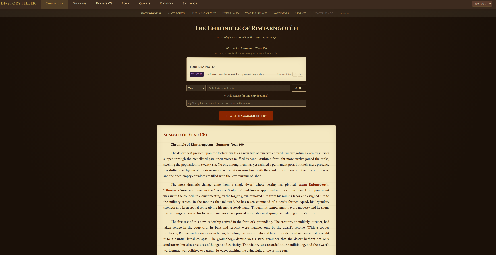
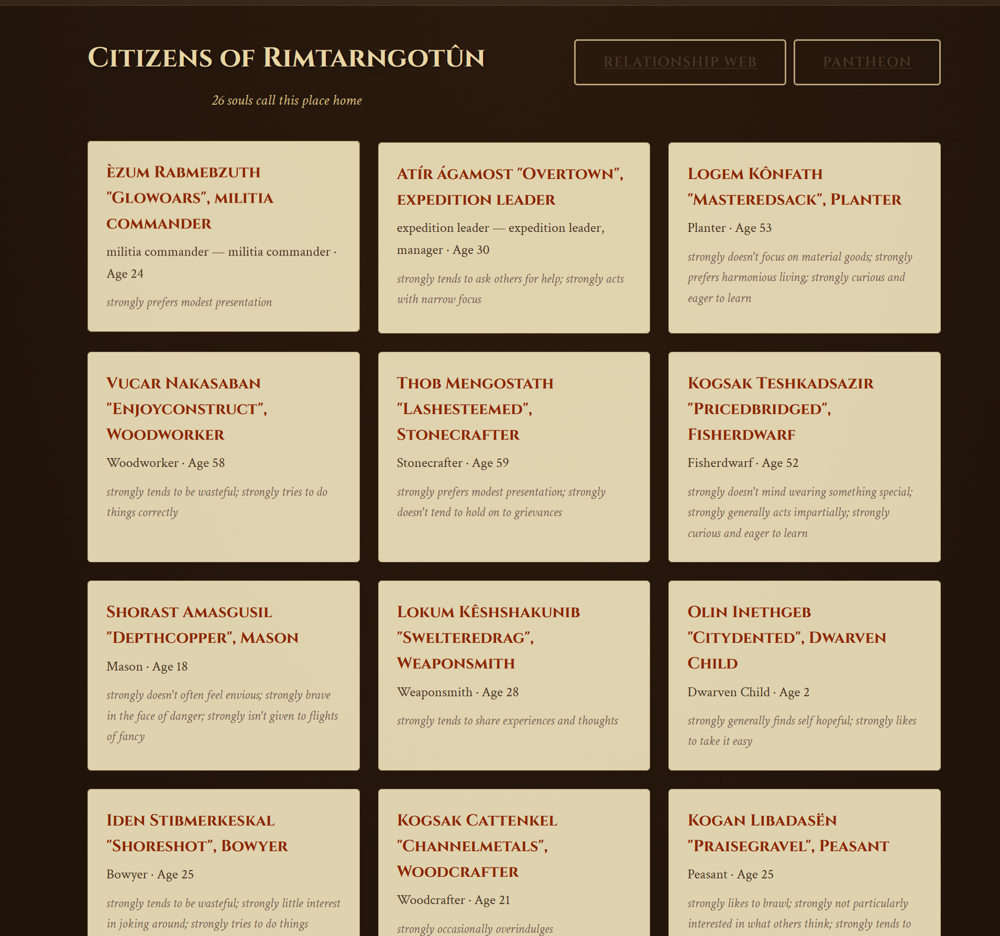
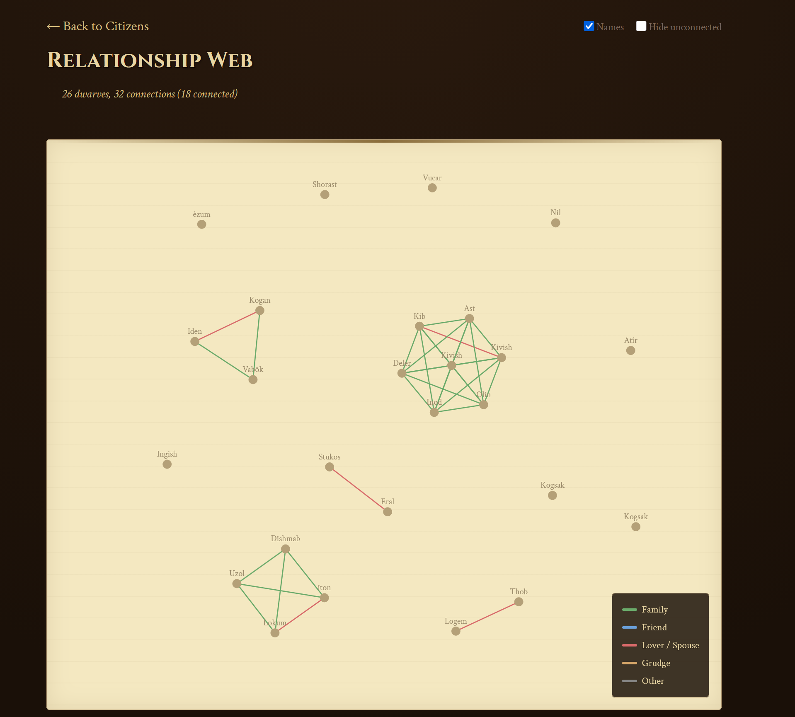
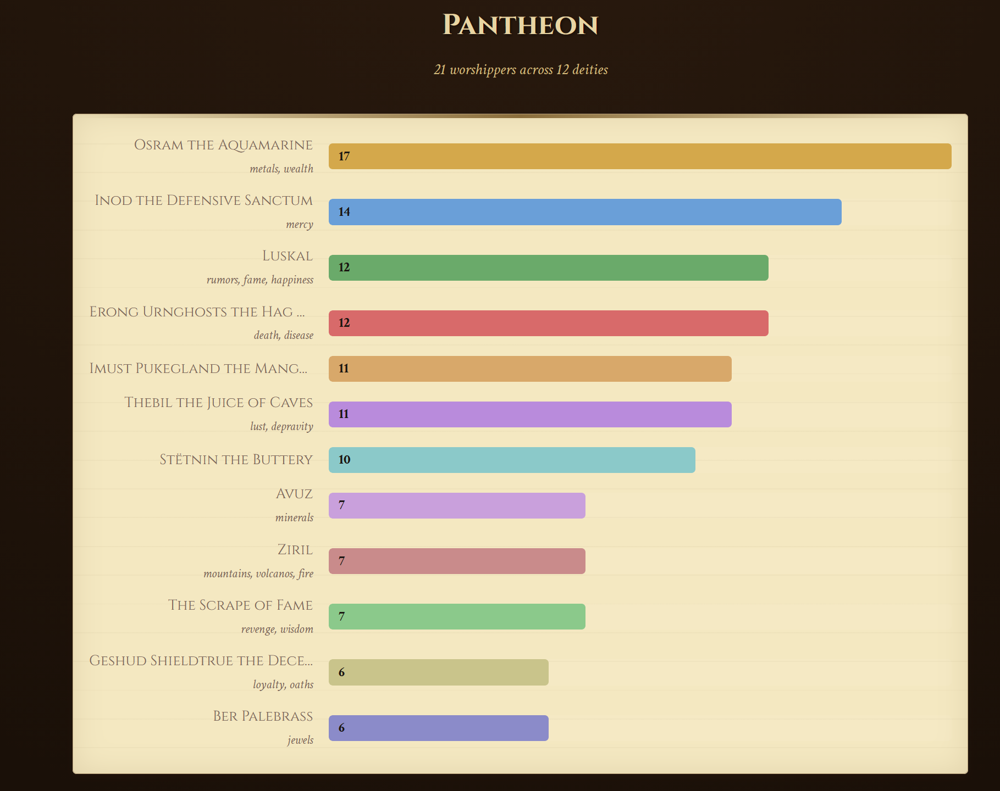
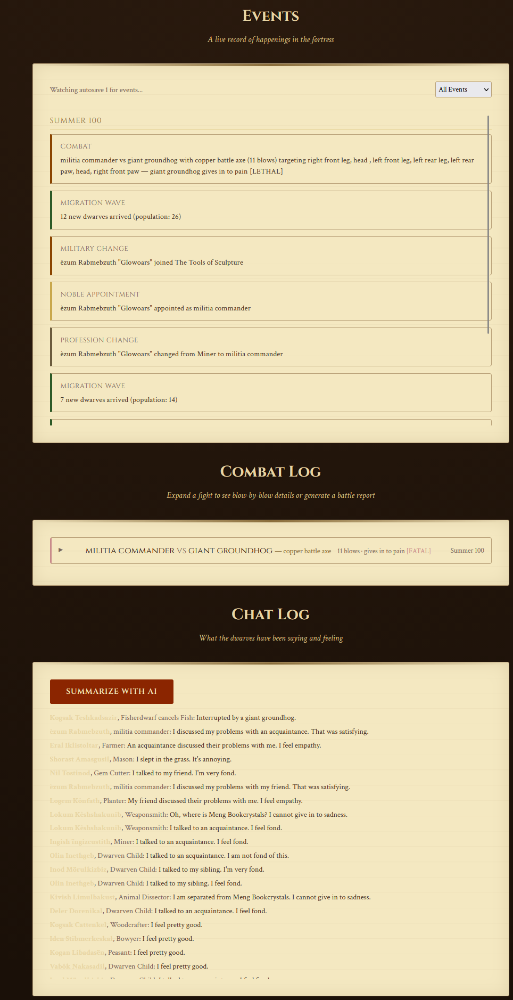
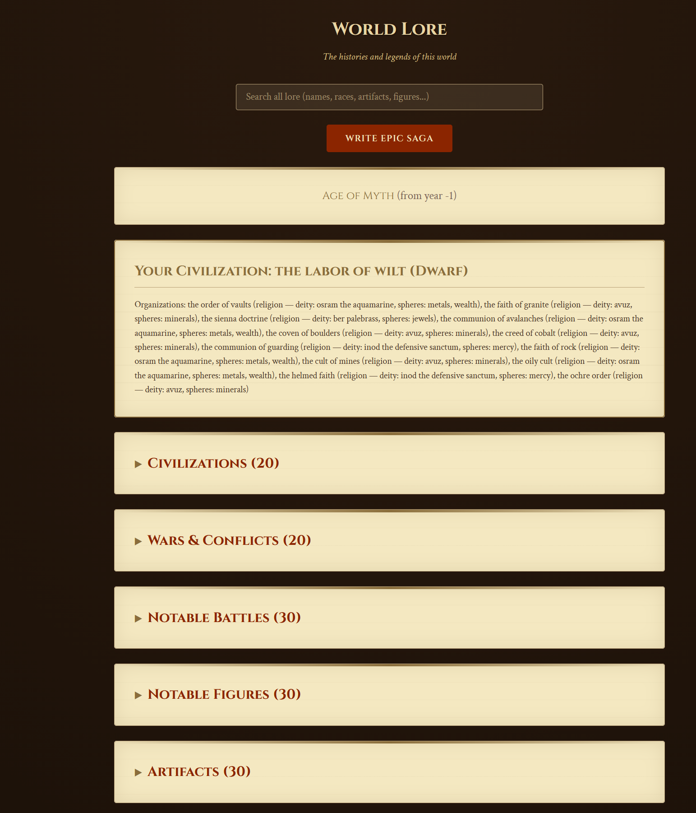
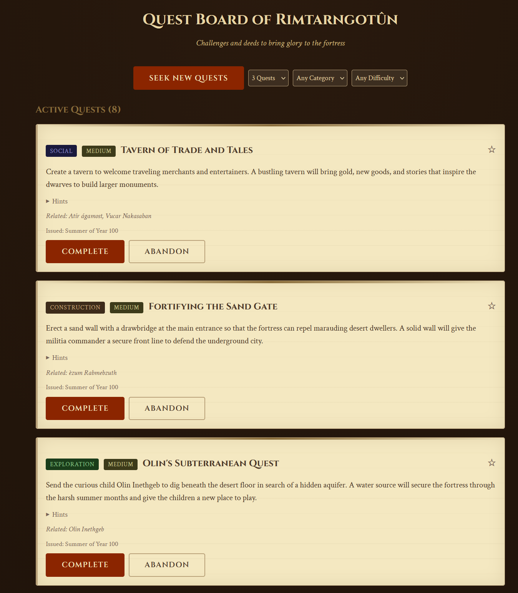
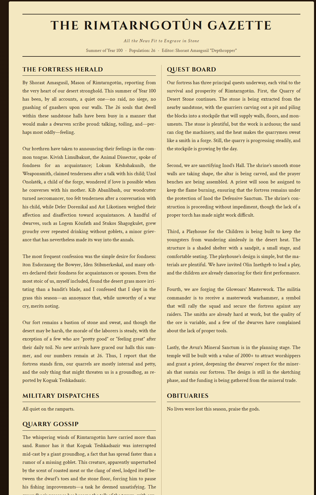

# df-storyteller

A fortress journal and storytelling companion for [Dwarf Fortress](https://store.steampowered.com/app/975370/Dwarf_Fortress/). Captures game events, dwarf personalities, and world history through [DFHack](https://dfhack.org/). Use AI to generate narratives, or write your own — the choice is yours.


> **[Full Documentation on the Wiki](https://github.com/Been012/df-storyteller/wiki)**

## Features

### Two Modes: AI or Manual
- **No-LLM Mode** — Use as a structured fortress journal. Write your own chronicles, biographies, gazette editions, sagas, and quests. No AI required.
- **LLM Mode** — AI generates narratives grounded in your gameplay. Manual writing is still available alongside AI output.
- Setup asks upfront — choose your preference during `init`, change anytime in Settings.

### Narrative Generation (AI or Player-Written)
- **Fortress Chronicles** — Seasonal narratives tracking what's changing in your fortress. Edit entries inline.
- **Dwarf Diaries** — First-person journal entries shaped by personality, beliefs, and stress
- **Character Biographies** — Dated entries that evolve as dwarves change over time
- **Death Eulogies** — Memorial narratives for fallen dwarves
- **Battle Reports** — Dramatic combat accounts written by survivors or the fortress chronicler
- **Epic Sagas** — World history narratives from legends data
- **Fortress Gazette** — A dwarven newspaper with five sections. Write your own or generate with AI. Edit published editions.

### Player Agency
- **Dwarf Highlights** — Mark dwarves as Protagonist, Antagonist, or Watchlist. Highlighted dwarves get more focus in AI narratives and show role badges across the UI.
- **Player Notes** — 8 tag types (Suspicion, Fact, Theory, Rumor, Secret, Foreshadow, Mood, What If) that influence how AI writes.
- **Manual Writing Everywhere** — Write your own entries on every page, even with AI enabled.
- **Inline Editing** — Edit chronicles, quests, and gazette editions after creation.

### Quest System
- **AI-Generated or Player-Created** — Generate quests from fortress state, or create your own with category and difficulty
- **Resolve with Comments** — Complete quests with a player-written resolution (no AI needed)
- **Edit on the Go** — Update quest titles and descriptions inline
- **Difficulty Tiers** — Easy, Medium, Hard, Legendary
- **Completion Narratives** — AI writes how the quest was fulfilled (LLM mode), or resolve manually

### Visualization & Data
- **Relationship Web** — Interactive force-directed graph of fortress connections
- **Pantheon** — Deity worship chart with sphere descriptions from legends
- **Combat Log** — Blow-by-blow fight details with siege grouping
- **Chat Log** — Dwarf conversations with AI social summaries
- **Lore Browser** — Searchable world history with hover tooltips (kill counts, battle forces, relationships)
- **Live Event Feed** — Real-time game events via WebSocket

## Screenshots

### Chronicle
AI-generated seasonal narratives that track migrations, conflicts, role changes, and the evolving story of your fortress. Includes fortress-wide player notes with 8 tag types that influence how the AI writes.


### Dwarves
Character sheets with tabbed Notes, Biography, and Diary sections. Personality traits, skills, relationships, combat record, and equipment. First-person diary entries written in the dwarf's voice based on their personality.


### Relationship Web
Interactive force-directed graph showing family, friend, rival, and deity connections across the entire fortress. Drag, zoom, hover for details, double-click to focus on a dwarf's connections.


### Pantheon
Bar chart of deity worship across the fortress, sorted by worshipper count. Click any deity to see who worships them. Sphere descriptions (death, minerals, sacrifice, etc.) pulled from legends data.


### Events
Live event feed via WebSocket, collapsible combat log with blow-by-blow fight details and siege grouping, battle reports written by survivors, and a chat log of dwarf conversations with AI social summaries.


### Lore
Searchable world history browser covering civilizations, wars, battles, historical figures, artifacts, and more. Hover tooltips show rich detail — kill counts, battle forces, relationships, deity spheres, artifact descriptions.


### Quests
AI-generated quests based on your actual fortress state — citizens, buildings, events, religion, military. Filtered by category and difficulty. Grounded in real DF mechanics. Completion narratives feed into future chronicles.


### Gazette
A dwarven newspaper with five sections: The Fortress Herald, Military Dispatches, Quarry Gossip, Quest Board, and Obituaries. Written by the fortress's best writer in their personality voice. Newspaper-style two-column layout.


## Quick Start

**Prerequisites:** [Python 3.11+](https://www.python.org/downloads/) — during install, check **"Add Python to PATH"**.

**Install and run:**
```bash
pip install df-storyteller
python -m df_storyteller init
python -m df_storyteller serve
```

**In DFHack console (first time per fortress):**
```
storyteller-begin
```

**Or install from source:**
```bash
git clone https://github.com/Been012/df-storyteller.git
cd df-storyteller
pip install -e .
python -m df_storyteller init
python -m df_storyteller serve
```

## Requirements

- **Dwarf Fortress** v50.x (Steam / DF Premium) — tested with v50.14
- **DFHack** v50.14-r1+ (Steam Workshop or [dfhack.org](https://dfhack.org/))
- **Python 3.11+**
- **An LLM provider** (optional — not needed for No-LLM mode):
  - [Ollama](https://ollama.com/) — free, runs locally, no API key needed (supports thinking models)
  - [Anthropic Claude](https://console.anthropic.com/) — API key required
  - [OpenAI](https://platform.openai.com/) — API key required

> **Note:** This tool uses DF Premium (Steam) APIs. Classic DF (pre-Steam) is not supported — some DFHack fields like `unit.relations` don't exist in the Steam version. We use `histfig_links` on historical figures instead.

## Tech Stack

- **Backend**: Python 3.11+, FastAPI, Pydantic v2
- **Frontend**: Jinja2 templates, vanilla CSS/JS (no build step)
- **Game integration**: DFHack Lua scripts
- **LLM**: Anthropic SDK, OpenAI SDK, Ollama REST API (with thinking model support)
- **All narratives grounded in DF mechanics** — the AI knows squad sizes, siege thresholds, temple values, what players can and cannot control

## Documentation

See the **[Wiki](https://github.com/Been012/df-storyteller/wiki)** for:
- [Installation & Setup](https://github.com/Been012/df-storyteller/wiki/Installation)
- [Architecture](https://github.com/Been012/df-storyteller/wiki/Architecture)
- [Configuration](https://github.com/Been012/df-storyteller/wiki/Configuration)
- [LLM Integration](https://github.com/Been012/df-storyteller/wiki/LLM-Integration)
- Feature guides for every tab

## Notes

- This tool is designed to run **locally on your machine** (localhost). It is not intended to be exposed to the internet or run on a public server.
- **Developed and tested on Windows** with DF Premium (Steam). Should work on Mac and Linux — all code uses cross-platform libraries (`pathlib`, FastAPI) and DFHack APIs are platform-independent — but these platforms are untested. If you run into issues, please [open a bug report](https://github.com/Been012/df-storyteller/issues/new?template=bug_report.md).
- Config and stories are stored at `~/.df-storyteller/`. API keys are in `config.toml`.

## License

MIT
